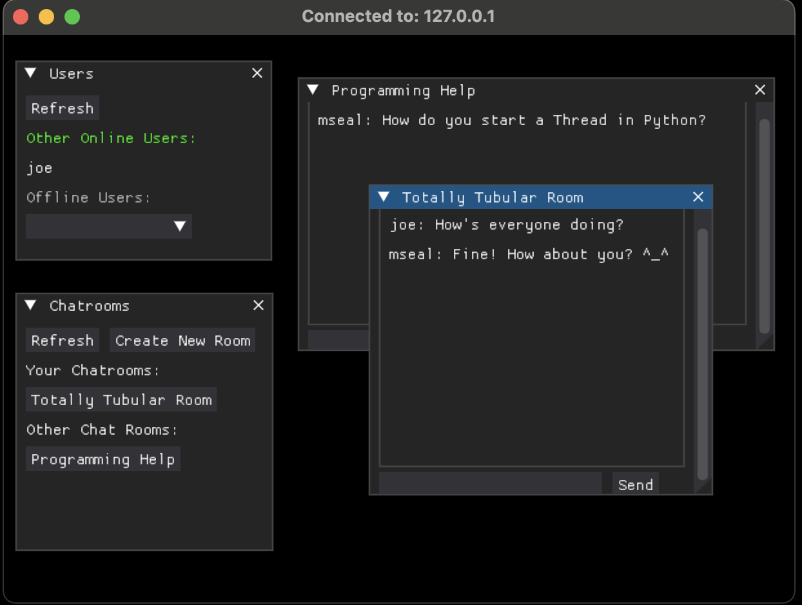
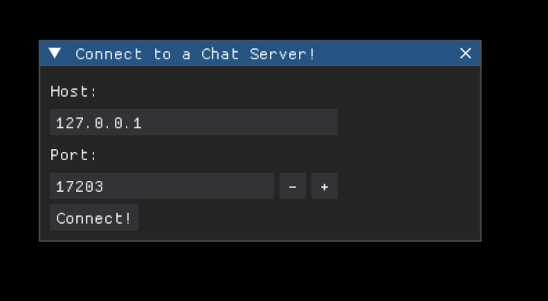
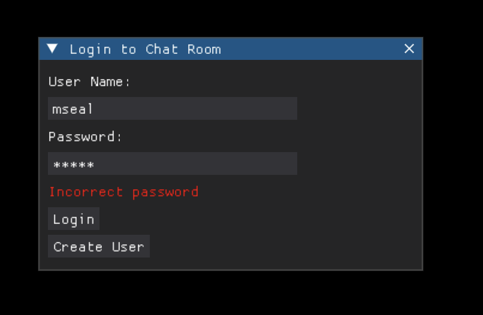

## Overview

The software is a light-weight and simple real time chat-room application with authentication built solely in Python to explore how two or more clients can communicate to each other via TCP through a central server.

It utilizes the [DearPyGui](https://github.com/hoffstadt/DearPyGui) framework to construct a GUI for clients.

The 'backend' of the application utilizes TCP sockets from the [socket](https://docs.python.org/3/library/socket.html) library to relay information to and from clients and the [sqlite3](https://docs.python.org/3/library/sqlite3.html) library to store information in a sqlite database.







## Installation Instrunctions

The chatroom and messaging application may work with other Python versions, but was developed and tested using Python 3.12+

- Create a python virtual enviroment

```bash
python -m venv src/venv
```

- Activate the created virtual environment

macOS and Linx

```bash
source src/venv/bin/activate
```

Windows

```bash
src\venv\Scripts\activate.bat
```

- Install required dependencies

Using Make

```bash
make pip_requirements
```

## Getting Started

### Server

With an active virtual environment, run the `make server` command

By default, the server binds on the `SERVER_HOST` and `SERVER_PORT` defined in `settings.json`

### Client/User

With an active virtual environment, run the `make client` client
